# Iniciación a GIT
## Instalación 
Descargar Git desde su [página oficial](https://git-scm.com/download/win) 

* Si utilizamos windows instalamos además **Git BASH**.

    *Bourne-Again Shell*
    Nos permite ejecutar los comandos de git y emular los comandos de linux.

    **No** vamos a utilizar la terminal de Windows. Utilizaremos *Git BASH*.

* Marcar: Usar librerías OpenSSL y OpenSSH.
    
    Ya que estas no son nativas en windows.
* Windows y linux graban en enter de forma distinta. 
    
    Marcar: *Checkout Windows-style, commit Unix-style line endings.* 
    
    En este caso, el enter se tomará según windows. Y al enviar el repositorio, se convertirá a la forma de linux.

    Esto te hace compatible con grupos de desarrolladores.
* Use MinTTY. Terminal de Git BASH.

---------- 

## Comandos básicos Linux 
> ### **ls** 
> lista la carpeta donde estamos 
>### **ls -l**
>lista. Muestra en forma de lista. 
>### **ls -la**
>lista + a. Muestra en forma de lista y los ocultos. 
>### **ls -lh**
>lista + human. Entendible para el humano.
>### **ls -ls**
>lista + size. Ordena por tamaño.
>### **ls -lsh**
>lista + size + human

>### **pwd**
>Print Working Directory. Muestra la ruta actual.

>### **cd** 
>Cambiar directorio.
>
>Sin parámetros. Ir a al home.
>### **cd ..**
>Paso atrás. 
>### **cd ./documents/dev**
>Ir directamente. 
>### **cd comienzo + tab**
>Empiezo el nombre del directorio y pulso tab. Me sugiere directorios con el mismo comienzo.

>### **↑  ↓ teclas de dirección** 
>Comandos utilizados

>### **tab**
>Autocompletar.

>### **file "archivo"**
>Muestra el tipo de archivo.

>### **ls** 
>lista la carpeta donde estamos 
>### **ls -l** 
>Long. Muestra más información. 
>### **ls -lh** 
>Long Human. Más información entendible al humano.

>### **mkdir nombre**
>Make Directory. Crea un directorio. 

>### **touch nuevo.txt**
>Crea un archivo.

>### **cat archivo.txt**
>Muestra un archivo.

>### **history**
>Historial de comandos utilizados anteriormente. Te lo muestra numerado.
>### **!32**
>Te vuelve a realizar el comando nº 32.

>### **clear**
>limpia la terminal 

>### **rm nuevo.txt** 
>Remove. Borra el archivo nuevo.txt

>### **cualquier comando --help** 
>Muestra una ayuda sobre el comando.
-----

## Comandos básicos de git 

>**git init**
>
>Inicia un repositorio. En el directorio en el que nos encontramos.

>**git init**
>
>Inicia un repositorio. En el directorio en el que nos encontramos.

>**git add archivo.txt**
>
>Añade este archivo al sistema de control de versiones.  

>**git commit -m "mensaje del commit"**
>
>Envia los últimos cambios del archivo, a la base de datos del sistema de control de versiones.

Tras haber realizado cambios en el archivo. Guardo los cambios de este. Le tenemos guardado en el disco duro.

A continuación, vamos guardar estos cambios en el repositorio. 

>**git add .**
>
>Añade todos los archivos que han cambiado en la carpeta en la que estás.

>**git commit -m "cambios, v2"**
>
>Guardamos estos cambios.

Podemos ver el estado de nues tra base de datos

>**git status**
>
>Si faltara algun cambio por subir. Nos lo indicará.

>**git show**
>
>Muestra el historial de cambios. 

>**git log archivo.txt**
>
>Muestra el historial de este archivo en específico.

### Borrar un archivo tras añadirle y antes de hacer commit 

>**git rm --cached archivo.txt**
>
>Borro de la memoria ram el archivo añadido. Y quedo a la espera de añadir cualquier otra cosa.  

Se realiza en caso de equivocación. Para volver un paso atrás.
___

## Configuración de Git
Para hacer commit, es necesario tener configurado un nombre de usuario y email.
>**git config** 
>
>Todas las configuraciones.

>**git config --list**
>
>Lista las configución por defecto de git.

Con estos comandos, vamos a configurar lo que nos falta.

>**git config --global user.name "Christian Díaz Pérez"**
>
>Configuramos nuestro nombre 

>**git config --global user.mail "christiandp99@gmail.com"**
>
>Configuramos el email

Volviendo a introducir git config --list

Podemos comprobar que los cambios han sido guardados.

---

## Actualizar cambios 
Al realizar cambios en el archivo y guardarlos. Es necesario actualizar los cambios en git. 

Realizando **git status**, nos indica hay otra versión. 

Es necesario realizar primero **git add archivo.txt**

O **git add .** Para actualizar todos los que se encuentren el el directorio.

Tras esto, realizamos **git commit -m "Actualización a versión 2"**

Finalmente, con **git status** versificamos.

## Histórico de cambios del repositorio 

>**git log**

## Cambios en el archivo 

>**git show**
>
>Muestra el último commit realizado.
>
>Cambios.
>
> Fecha. Autor.

Al ejecutar show nos muestra un **diff**.

>**git diff nºcommit1 nºcommit2**
>
>Una comparación de la versión actual con la anterio.

>**code historia.txt**
>
>Abre directamente un editor de código.

---

## Staging
Memoria temporal.

Al hacer **git add**, el archivo pasa de estado untracked a tracked.

Podemos quitar de stagin un archivo con **rm archivo.txt**

**Master** Es la última versión del proyecto. Se encuentra en el repositorio.

---

## Volver en el tiempo en el repositorio

Antes debemos comprobar los commits realizados con **git log**.
Nos referiremos a cada commit mediante su nº identificativo

Para volver a una versión anterior utilizamos **git reset**. 

Disponemos de 2 tipos:

>**Git reset nºidentificativo --hard**
>
>Todo vuelve al estado anterior.
>
Es el más peligroso. Y más utilizado.

El nº identificativo del commit, ha de ser el de la versión a la que queremos volver.

Al ejecutar este comando, los cambios se realizan en el archivo de forma automática.

Además, los commits posteriores a la versión que hemos reseteado, desaparecerán. 

>**Git reset nºidentificativo --soft**
>
>Todo vuelve al estado anterior.
>
>Pero mantiene los archivos que se encuentran en staging.

Una vez realizado **git reset nºidentificativo --soft**,
Ejecutamos **git diff master**, nos muestra la diferencia entre la versión actual (**master**) y lo que se encuentra en stagin. 

Por lo que, realizando:
**git commit** restauro en un nuevo commit los archivos que se encuentran en stagin. 
De esta forma, restauramos el **Git reset nºidentificativo --soft**

>**git log --stat**
>
>Muestra los cambios específicos realizados. Y en que archivos.
>
>Toda esta información es muy larga. Por lo que con las flechas ↑↓, navegamos por ella. Presionando **q** salimos.

>**git checkout nºidentificativo historia.txt**
>
>Nos muestra el archivo en concreto en esa versión.
>Pero no ha realizado ningún cambio en el repositorio.
>

Estos cambios se guardan en el stagin. Por lo que al realizar un commit serán guardados.

Para eliminar esto del stagin realizamos **git checkout master historia.txt**

Nos restaurará la versión master en el editor de código y en el staging.

## Flujo de trabajo básico con un repositorio remoto 

**Repositorio remoto o servidor remoto** 

Servidor que aloja una cópia del código. Compartido con mas desarrolladores. Estos trabajan en local, los cambios son enviados al servidor.

Github o Gitlab son los más comunes.

>**git clone url**
>
>Te crea una copia del master en tu repositorio local. Además de la bases de datos de cambios históricos de git.

>**Git push**
>
>Envio la última versión del master al servidor remoto.

>**Git pull**
>
>Una vez tengo clonado el repositorio remoto. Actualizo mi repositorio local. Con la última actualización introducida por otro desarrollador. 
>
>Modificando el área de trabajo y el repositorio local.

## Otra forma de hacer **add .** y **commit** a la vez 

>**git commit -am "mensaje"**
>
>Realiza el commit automáticamente sin necesidad de ejecutar el add .
>
>Con archivos creados recientemente no funciona. Estos deben haber sidos rastreados al menos una vez con **add .**

#  Branches o ramas 

**master** es la rama principal.

Ejecutando **git show** puedo ver el head. Es decir, el lugar donde me encuentro trabajando.

En este caso, el head se encuentra en el master. En la versión más reciente 

Al cear una rama, se crea una copia del master. Para trabajar en esta de forma independiente.

Vamos a crar una rama con el nombre cabecera.
>**git branch cabecera**

Comprobamos con **git show**

El último commit se encuentra en master y cabecera. 

Además, me encuentro trabajando en master.

>**git checkout cabecera**
>
>Me muevo a la rama cabecera.

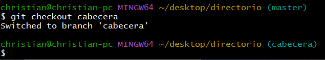

Una vez realizado cambios en el directorio de trabajo envío el commit a la rama cabecera.

Compruebo con **git show**

Compruebo el historial con **git log**

Nos indica que estaba en master y ahora el head se encuentra en cabecera.

## Pasar el puntero de trabajo a la rama master

>**git checkout master**

Además de cambiarnos el apuntador de trabajo a master.

Nos cambia el editor de código a la versión de master automáticamente.
___
## Introducir cambios en una rama y hacer merge con el master

>**git branch**
>
>Muestra las ramas del proyecto y en la que nos encontramos.
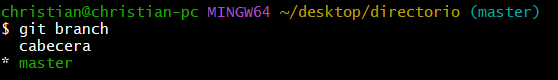

Nos movemos a la cabecera con **git checkout cabecera**

Antes de editarlo.
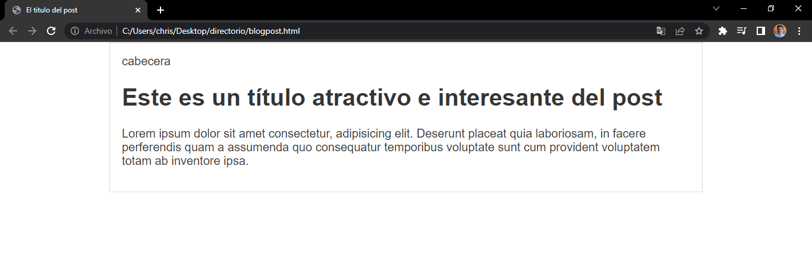

Introducimos cambios en el html y css.

Si ahora hacemos checkout al master, es decir, nos movemos de la rama cabecera al master. Perderé todos los cambios introducidos.

Realizamos **git commit -am "mensaje"**

Rama cabecera actualizada. 
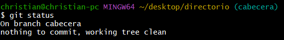

Nos cambiamos a la rama master. Introducimos un párrafo nuevo y cambiamos la tipografía.
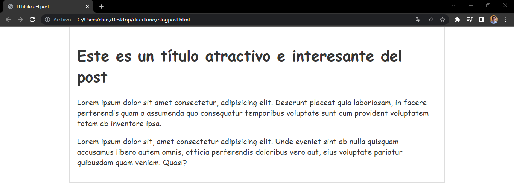

Realizamos commit.

A continuación vamos a traer el código de cabecera a master. Realizaremos un merge.

Un merge es un tipo de commit.

Fusiona el último commit de master y cabecera. 

El merge se realiza en el destino. Por lo que **debemos estar en la rama master.**

Será el final de la rama cabecera.
>**git merge cabecera "mensaje"**

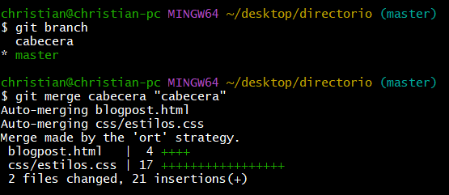

Aquí tenemos el resultado
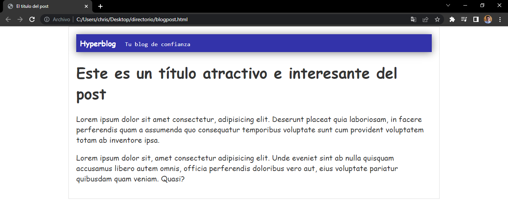

Además me añade al master los commits de la rama cabecera.

---

## Resolución de conflictos al hacer un merge

Primero traigo los cambios de master a cabecera con merge. Para tener dos copias iguales.

Estando en cabecera, ejecuto: **git merge master**
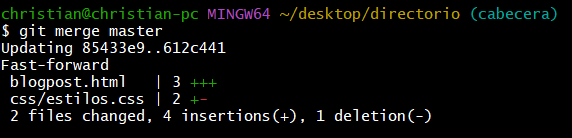

Para crear un error. Debemos de modificar las mismas líneas en ambas ramas.

Modifico la cabecera y el color del texto. Además realizo los commits en ambas ramas.

### Versión master

Añado un párrafo extra  al final.

### Versión cabecera

Me situo en master. Donde me quiero traer los cambios.
Por lo que, desde master voy a realizar el **git merge**

Nos detecta conflicto en html y css. 

El merge no se ha realizado. Para que se realice un merge, ha de completarse un commit.
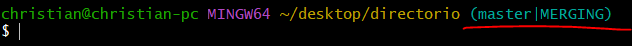

Nos indica mediante un mensaje: 

En la **versión master** el color es verde 
En la **versión cabecera** el color es rojo 

En este caso no voy a optar por ninguno de los dos. 

Borro el mensaje, agrego el color deseado y guardo con ctrl + s.

### Conflicto en el html. 

El último párrafo no supone ningun conflicto ya que únicamente se encuentra en el master.

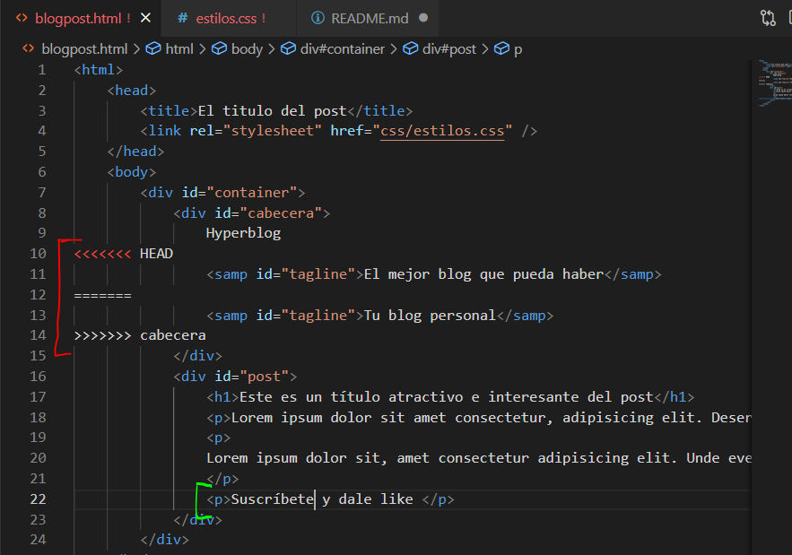

Opto por una de las versiones, borro el mensaje y guardo.

Ejecuto el commit del estado **MERGING**
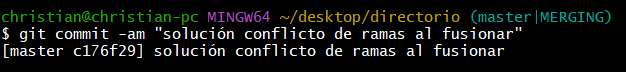

Importante añadir -a (add) para rastrear los nuevos cambios introducidos.

Finalmente realizo el commit de los cambios y compruebo el estado de la rama master.

# Clonar un repositorio

Únicamente si disponemos de un repositorio remoto y queremos traerlo a nuesto PC.

> **git clone "URL del repositorio"**
>
>Clona un repositorio remoto en nusto PC.

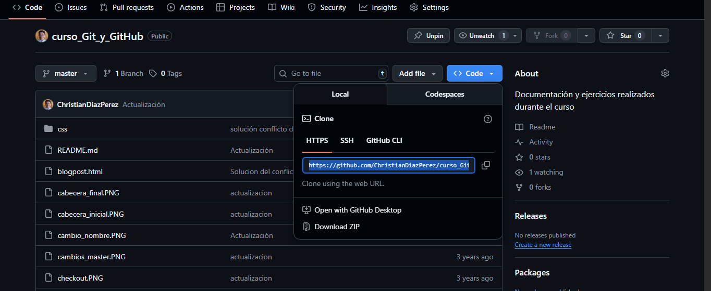

Antes de nada, debemos ubicarnos en el directorio donde queremos clonar el repositorio.

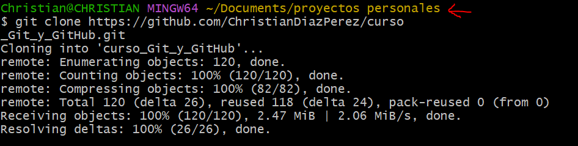

# Subir un repositorio a GitHub

Esta opción es utilizada cuando ya disponemos de un repositorio únicamente existente en nuestro PC. Y lo queremos subir a GitHub.

Empezaremos por crear un repositorio.

GitHub a la rama master, la llama main.
Por lo que para evitar problemas, voy a modificar el nombre de la rama main a master en GitHub.
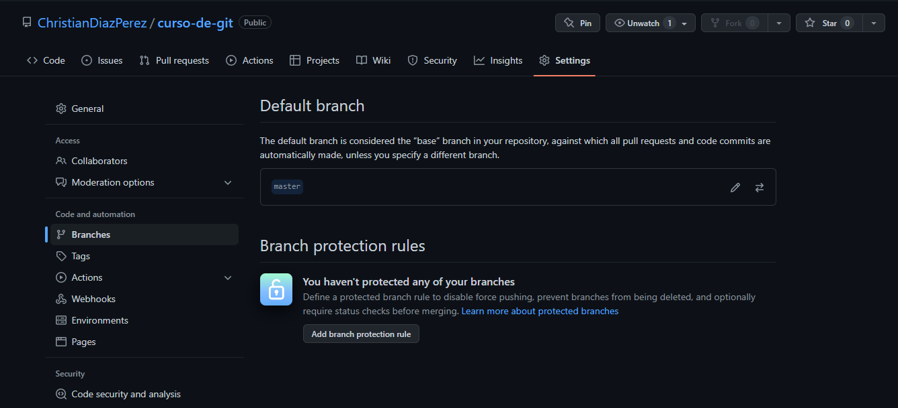

Una vez creado, vamos a clonarlo.

Copiamos esta URL utilizando HTTPS
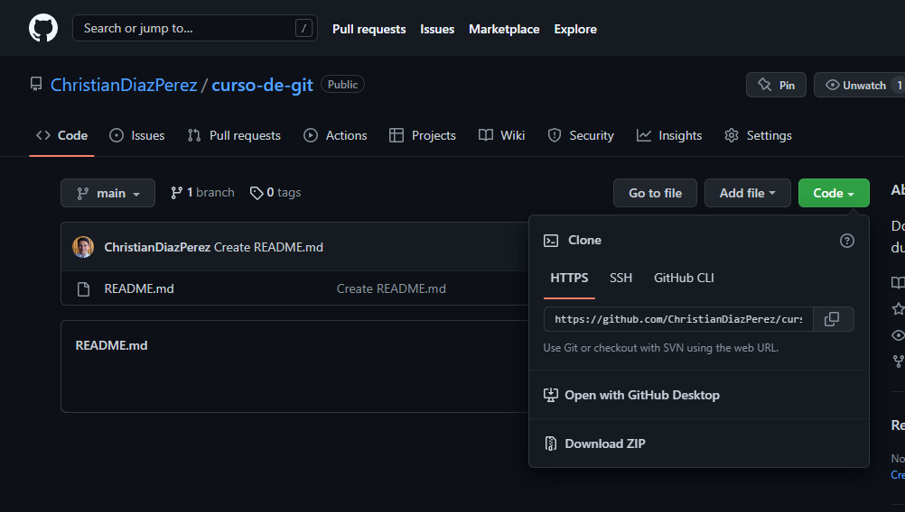

Nos aseguramos de estar en la rama master.

Vamos a añadir a git un **origen remoto** de nuestros archivos.

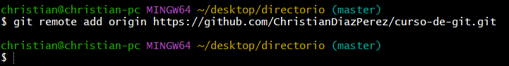

Comprobamos el estado.  
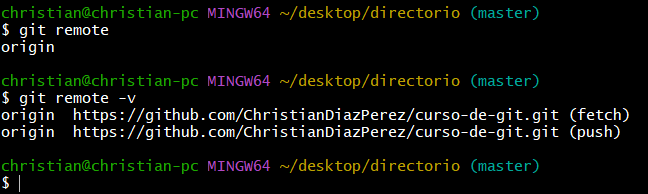

-v (sea verbal)

nos indica: 

origin para hacer fetch, traer cosas
origin para hacer push, enviar cosas

## **push**

> **git push origin master**
>
>para enviar al origen, la rama master.

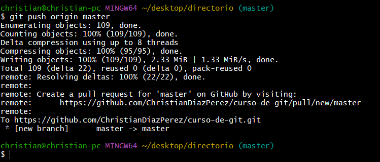

El master local se envió al master de GitHub creando una nueva rama.

